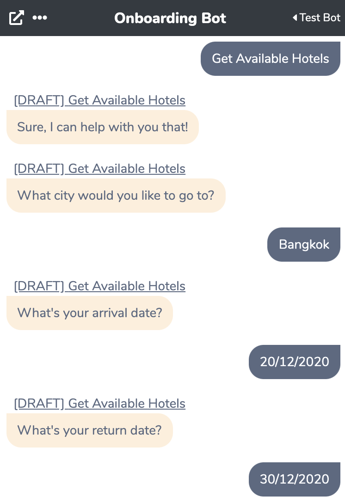
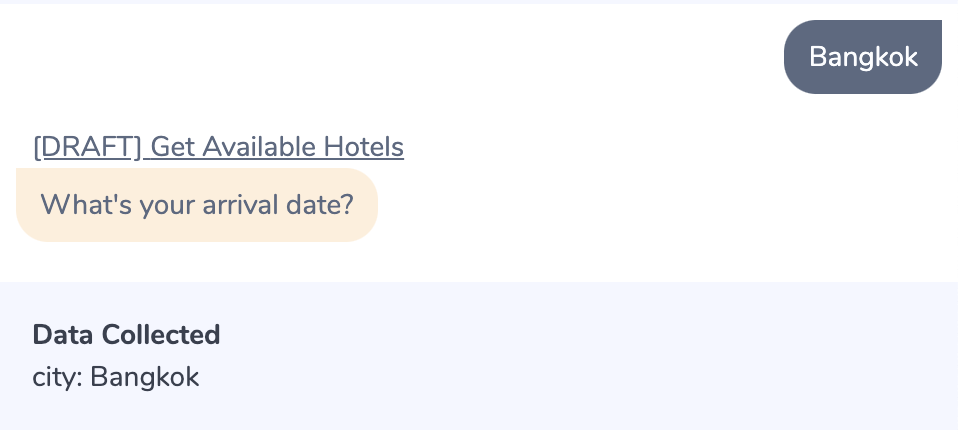

# Building Transactional Flows

## Introduction

Transactional Conversation Flows are interactions with the Bot that require calling one or more external web services in order to fulfil the Chat User's request.

Some examples of Transactional Flows include:

* Making an appointment booking with a Customer Support Representative
* Submitting an Insurance Claim
* Resetting an user account's password

Converse makes it straightforward to execute custom functionality that performs performs web service calls and run computation logic by providing:

* Converse Plugin SDK \(Java\)
* Converse Middleware, which serves as a Plugin Manager to host compatible Plugins

For details on how the Plugin Architecture works and how to build custom Plugins, please see [Converse Middleware Plugins](data-integrations.md#converse-middleware-plugins)

This guide provides instructions for building a Flow that provides available Hotels for a given city, an arrival date and a return date. Note: You will need the "Flights And Hotels" Plugin to be installed on the Converse Middleware to follow through this guide. This should come as standard with Demo/Sandbox Converse installation for testing purposes.

## Step By Step Guide

<table>
  <thead>
    <tr>
      <th style="text-align:left">Step Description</th>
      <th style="text-align:left">Example</th>
    </tr>
  </thead>
  <tbody>
    <tr>
      <td style="text-align:left">
        
<b>Step 1</b>
        

        <ul>
          <li>Navigate to the Intent Management page</li>
          <li>Create a new Intent called <b>&quot;Get Available Hotels&quot;</b>
          </li>
        </ul>
      </td>
      <td style="text-align:left">
        
      </td>
    </tr>
    <tr>
      <td style="text-align:left">
        
<b>Step 2</b>
        

        <ul>
          <li>Add a phrase to the intent and hit Enter</li>
          <li>Then close the Phrase Panel</li>
        </ul>
      </td>
      <td style="text-align:left">
        
      </td>
    </tr>
    <tr>
      <td style="text-align:left">
        
<b>Step 3</b>
        

        
In the first State do the following:

        <ul>
          <li>Change State Name to &quot;<b>Collect City</b>&quot;</li>
          <li>Add 2 Text Message components to the State and enter in the content in
            the screenshot on the right</li>
          <li>Add the Data Collection block and set the <em>variable</em> field to &quot;<b>city&quot;</b>
          </li>
        </ul>
      </td>
      <td style="text-align:left">
        

          
        

        

          
        

      </td>
    </tr>
    <tr>
      <td style="text-align:left">
        
<b>Step 4</b>
        

        <ul>
          <li>In the Graphical Editor, click on the
            button in the under the State Node</li>
          <li>In the Popup that appears, enter &quot;<b>Collect Arrival Date</b>&quot;.</li>
          <li>Click Save to Create the new State</li>
        </ul>
      </td>
      <td style="text-align:left">
        
      </td>
    </tr>
    <tr>
      <td style="text-align:left">
        
<b>Step 5</b>
        

        <ul>
          <li>In the newly created<em>&quot;Collect Arrival Date&quot;</em> State:</li>
          <li>Add a Text Message Component with the text: <b>&quot;What&apos;s your arrival date?&quot;</b>
          </li>
          <li>Add the Data Collection block and set the <em>variable</em> field to &quot;<b>arrivalDate&quot;</b>
          </li>
        </ul>
        
Now, follow the same process in Step 4 and create a new State named: &quot;<b>Collect Return Date</b>&quot;

      </td>
      <td style="text-align:left">
        
      </td>
    </tr>
    <tr>
      <td style="text-align:left">
        
<b>Step 6</b>
        

        
In the newly created <em>&quot;Collect Return Date&quot;</em> State:

        <ul>
          <li>Add a Text Message Component with the text: <b>&quot;What&apos;s your return date?&quot;</b>
          </li>
          <li>Add the Data Collection block and set the <em>variable</em> field to &quot;<b>returnDate&quot;</b>
          </li>
        </ul>
        
Now, follow the same process in Step 4 and create a new State named: &quot;<b>Call Service</b>&quot;

      </td>
      <td style="text-align:left">
        
      </td>
    </tr>
    <tr>
      <td style="text-align:left">
        
<b>Step 7</b>
        

        
Great! Now you have set up the Flow to collect all the required user inputs.
          Now, we will configure the Service call via Service Action block

        
In the newly created <em>&quot;Call Service&quot;</em> State:

        <ul>
          <li>Add a Service Action Block and set it up like the screenshot on the right.</li>
          <li>Note that the Reference ID of the Service Action is set to &quot;<b>hotelsApi</b>&quot;.
            This reference ID will be used in future steps.</li>
        </ul>
      </td>
      <td style="text-align:left">
        
      </td>
    </tr>
    <tr>
      <td style="text-align:left">
        
<b>Step 8</b>
        

        
In the <em>&quot;Call Service&quot; State:</em>
        

        <ul>
          <li>Set the Text Message component&apos;s text to &quot;<b>Getting available hotels&#x2026;</b>&quot;
            to inform the Chat User that processing is ongoing.</li>
        </ul>
      </td>
      <td style="text-align:left">
        
      </td>
    </tr>
    <tr>
      <td style="text-align:left">
        
<b>Step 9a</b>
        

        
In the <em>&quot;Call Service&quot; State:</em>
        

        <ul>
          <li>Add a Transition that checks if an error has occurred in the Service Action</li>
          <li>This is done by checking the <b>error.message</b> property of the Service
            Action exists.</li>
          <li>If this condition is true, then the Transition will trigger.</li>
        </ul>
      </td>
      <td style="text-align:left">
        
      </td>
    </tr>
    <tr>
      <td style="text-align:left">
        
<b>Step 9b</b>
        

        
Now complete setting up the Transition by specifying the Destination State
          to go to if the Transition&apos;s Condition is true.

        <ul>
          <li>Click on &quot;+ Add New State&quot; in the dropdown to create a new Destination
            State.</li>
          <li>In the Popup that appears, enter the State Name as &quot;<b>Failure</b>&quot;</li>
          <li>Click Save to create the new State.</li>
        </ul>
      </td>
      <td style="text-align:left">
        

          
        

        

          
        

      </td>
    </tr>
    <tr>
      <td style="text-align:left">
        
<b>Step 9c</b>
        

        
Verify that the Transition has been set up like the screenshot on the
          right.

      </td>
      <td style="text-align:left">
        
      </td>
    </tr>
    <tr>
      <td style="text-align:left">
        
<b>Step 10</b>
        

        
In the <em>&quot;Call Service&quot; State:</em>
        

        <ul>
          <li>Create another Transition to check if there were no results found</li>
          <li>To do so, check if the <em>numHits</em> property in the data object is equal
            to <b>0</b>.</li>
          <li>Note: We know there is a <em>numHits</em> data property because it is specified
            in the Plugin Function&apos;s Data Outputs (see Step 7)</li>
        </ul>
      </td>
      <td style="text-align:left">
        
      </td>
    </tr>
    <tr>
      <td style="text-align:left">
        
<b>Step 11</b>
        

        
In the <em>&quot;Call Service&quot; State:</em>
        

        <ul>
          <li>Scroll to the bottom of the State Editor to find the Dialog Settings panel.</li>
          <li>Toggle <b>OFF</b> Ready To Reply</li>
          <li>This tells the Dialog Engine to evaluate the Transitions and trigger the
            next State without waiting for a User Input.</li>
        </ul>
      </td>
      <td style="text-align:left">
        
      </td>
    </tr>
    <tr>
      <td style="text-align:left">
        
<b>Step 12</b>
        

        
Click on the &quot;<em>Failure</em>&quot; State in the Graphical Editor
          to edit it.

        
Set the Text Message component with the content shown on the right.

      </td>
      <td style="text-align:left">
        
      </td>
    </tr>
    <tr>
      <td style="text-align:left">
        
<b>Step 13</b>
        

        
Click on the &quot;<em>No Available Hotels</em>&quot; State in the Graphical
          Editor to edit it.

        
Set the Text Message component with the content shown on the right.

      </td>
      <td style="text-align:left">
        
      </td>
    </tr>
    <tr>
      <td style="text-align:left">
        
<b>Step 14</b>
        

        
Click on the &quot;<em>Display Hotels</em>&quot; State in the Graphical
          Editor to edit it.

        
Set the Text Message component with the content shown on the right.

        
Note: We can use the <em>numHits</em> property in the Text Message Component
          by surrounding it with a <code>%()</code>
        

        
Add a Dynamic Component, and set the value with the content shown on the
          right.

        
Here, we are displaying the Message Component(s) dynamically generated
          by the Converse Plugin Function. In this case, it is a Carousel Component
          containing a list of Hotels.

      </td>
      <td style="text-align:left">
        
      </td>
    </tr>
  </tbody>
</table>

**Step 15**

Test the flow! Scroll up to the Intent Header, and click on the Quick-Test icon on the right side of the Intent Name.

Use the Admin Chat UI's Info Panel to view Data Collected or Data sent to/from Service Action

To open the panel, click on the "..." on the top-left side of the Admin Chat Header \(as below\).

|  |  |
| :--- | :--- |

**Step 16**

**Activate the Intent** by clicking on the "Activate Intent" button at the top-right side of the page.

The Intent Status label should now be "Active"

You're all done! You just successfully created a Transactional Flow using Service Action.

Using the process described in this guide, we can build complex conversational processes involving multiple Service calls, and weave dynamic data and static dialog content into a smooth conversational experience.

