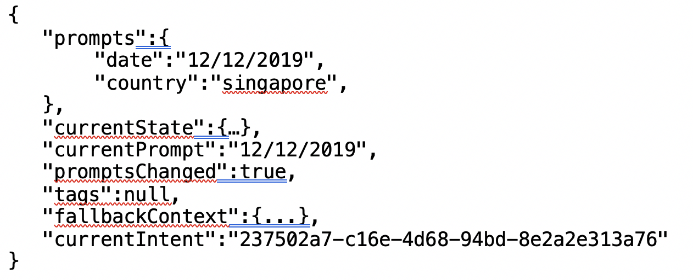

# Data Integrations

## Converse Middleware Plugins

From v2.6.0, the Converse Platform provides a Middleware that allows developers to deploy reusable Plugins to serve as Connectors to other web services, and/or run any custom computation logic. Plugins are Java \(JAR\) programs that can be seamlessly executed by the Dialog Manager. Each Dialog State can be configured to execute a Plugin's functionality via the Service Action State Block \(see Service Action Block to see usage details\).


For details on how to create a Converse Middleware Plugin, you may reference the documentation [here on Github](https://github.com/taigers/converse-plugins/blob/master/md/src/SUMMARY.md). This repository also provides sample Plugins to kickstart your development process.

## Configuring a Webhook Connector

Here you can configure Webhook Connector for the bot to call upon reaching the state. Webhook Connectors are Web Services or API Endpoint that receives a JSON payload from Converse, and synchronously responds with data that can be utilized by Converse in the Dialog Sequence.

A Webhook Connector can be implemented in any programming language or platform. It simply needs to expose an endpoint that receives a JSON request body, and responds with data as specified in this document

To specify the web service to be triggered by the Dialog Engine, provide the URL in the Service Action Block of the State Editor.

Example:


### Request Payload

The following request data is sent via HTTP POST from the Converse Dialog Engine to the specified Web Service endpoint:



| **Key** | **Description** |
| :--- | :--- |
| prompts | Variables captured in the Context of the dialog sequence. Data collected from users will be stored here. |
| currentState | The current State that the Dialog Engine is currently on |
| currentPrompt | Current user utterance |
| promptsChanged | Flag to identify change in prompts |
| tags | The tags of all the intents triggered during the course of conversation. |
| fallbackContext | Information regarding the fallback |
| currentIntent | The ID of the current Intent |

### Response Payload

Converse expects the response data from the Web Service to be of the following JSON structure. All properties are optional.

```text
{
  "message":"this is a message",
  "data":{...},
  "links":[...]
}
```

#### **message**

If a **message** property is specified, it will be output as the Bot message.

```text
{
  "message": "this is a message"
}
```

| **Key** | **Description** |
| :--- | :--- |
| message | The text to display as a reply |

Example:


#### **links**

The links may contain a list of intent IDs and labels which is will output on the Chat UI as clickable buttons. Users will be able to trigger the respective intent when they click on the button.

```text
{
  "links":[
    {
      "enquiry":"2d2dd0ff-8870-4401-4444-8374d7aafe04",
      "text":"Things to do in China"
    },
    {
      "enquiry":"2d2dd444-8870-4401-b76c-8374d7aafe04",
      "text":"Things to do in India"
    }
  ]
}
```

| **Key** | **Description** |
| :--- | :--- |
| enquiry | The Intent ID to be triggered |
| text | The text to display on the button for the respective enquiry |

For the data above, the UI will display the following:


#### **data**

The data object should contain key-value pairs. The key of each variable will be used as the variable’s name, which can be referenced inside a State’s Content field \(see screenshot below\).

Given the following data:

```text
{
  "data": {
    "country": "Singapore",
    "date": "19/01/2020",
    "locationTemperature": 26,
    }
}
```

And the following template in the State’s Context field:


When the State is triggered, then bot will respond with the following message:


