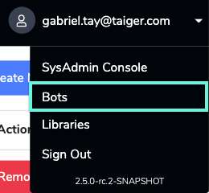
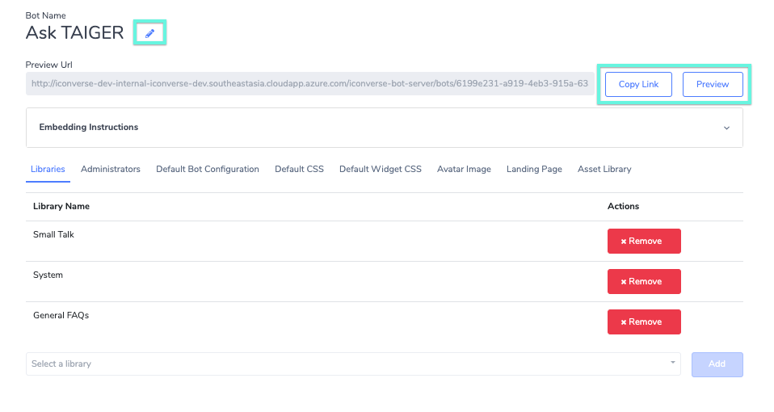
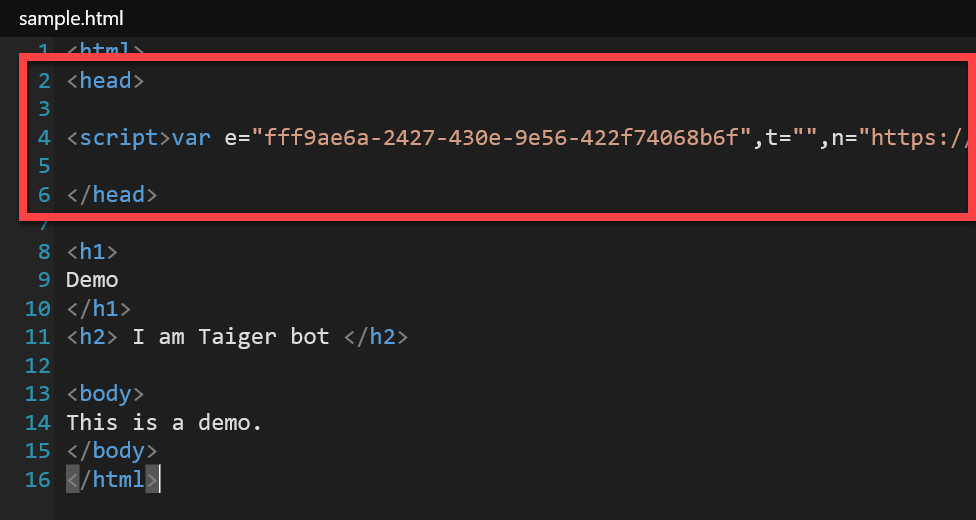
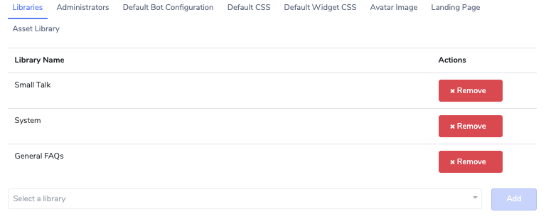
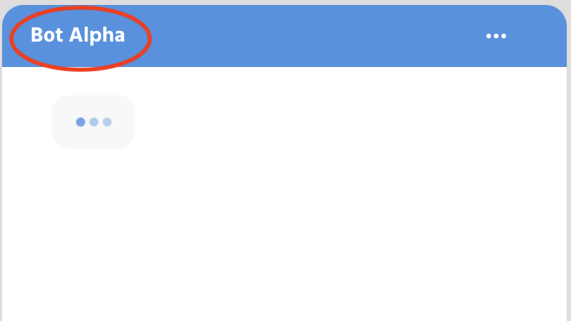
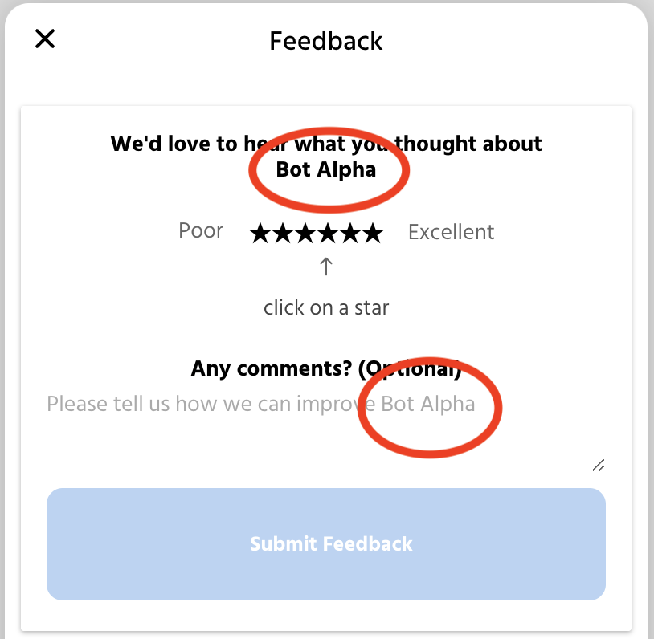
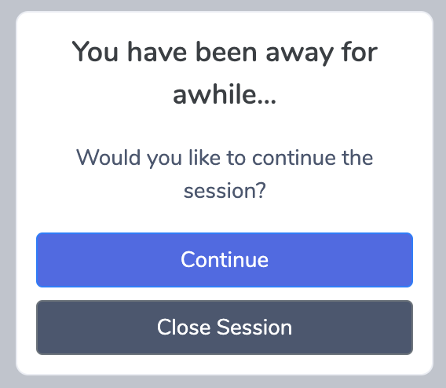
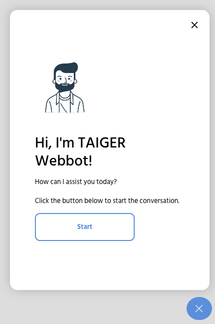

# Bot Management

Bot Administrators can manage the bot by creating bot or multiple bots and assigning libraries for each bot, together with the access role and permissions.

The Bot Manager page is where you can manage the bots and access rights.

**To access the Bot Manager:**

Click on your user profile on the top-right corner and click Bots.

A list of existing bots will appear. To manage a bot, click on its name. You will then be redirected to the Edit Bot page.

## Creating New Bot

To create a new bot:

1. On the Bot Manager page, click . A pop-up window will be displayed asking for the Bot Name.
2. Enter the name in the **Bot Name** field and click on .

1. Once the bot is created, select it to view the bot details. You can edit the name of the bot clicking theicon.
2. Click on the  and the bot created will appear in another browser tab. You can also click  and paste it to another browser tab to display the new created bot.

After clicking  or pasting the link into another browser tab, the bot will appear as shown below.

## Edit Bot Name

To editing bot name, simply navigate to the

1. Select the bot from the bot manager page to navigate to the Edit Bot page.
2. Click on theicon beside the bot name to enable editing.

1. Enter the new name for the bot and press the enter button on the keyboard to save changes.

## Embedding Bot on Webpage

To embed the bot to another HTML page:

1. Select the bot from the bot manager page to navigate to the Edit Bot page.
2. Copy the Chat Widget Embedding Code Snippet in the **Embedding Instructions** section by clicking on the button.

1. Paste the code after the &lt;HEAD&gt; tag of the HTML page and before `<HEAD>`tag.

1. Now, open the HTML file to a web browser and the new bot displays.

!\[A screenshot of a cell phone

Description automatically generated\]\(../.gitbook/assets/199.png\)

## Bot Options

In the Edit Bot page, you can configure the Bot in the following tabs:

### **Libraries**

The area where you add and assign libraries to the Bot.

As an Administrator, you can assign libraries as long as you have Owner/Edit permissions assigned to you by the Super Administrator.

The area where you assign roles and permissions for access to the bot. By default, the user who created the bot has the Owner permission. You add or remove users to the bot by clicking on the  and  button respectively.

### Administrators

<table>
  <thead>
    <tr>
      <th style="text-align:left"><b>Roles</b>
      </th>
      <th style="text-align:left"><b>Permissions</b>
      </th>
    </tr>
  </thead>
  <tbody>
    <tr>
      <td style="text-align:left">Owner</td>
      <td style="text-align:left">
        
- Able to Add and Remove Administrators

        
- Able to edit the permissions assigned for the bot.

      </td>
    </tr>
    <tr>
      <td style="text-align:left">Edit</td>
      <td style="text-align:left">Can manage all Content for the Bot - Edit Libraries, Intents, Manage Unhandled
        Phrases, etc (See <a href="user-and-roles-management.md#roles-and-access-rights">Roles and Access Rights</a> for
        details)</td>
    </tr>
    <tr>
      <td style="text-align:left">Read Only</td>
      <td style="text-align:left">Can only view the Bot&apos;s Content - no edit rights are given.</td>
    </tr>
  </tbody>
</table>

### Default Bot Configuration

> Note: This section requires technical understanding of JSON syntax to use properly.

Here you can update the bot configuration which controls the Bot's behavior and functionality.

These are the options available for editing:

#### **Bot Name**

| **Type** | **String** |
| :--- | :--- |
| **Default** | **&lt;Bot Name&gt;** |

Use this value to override the Bot Name used throughout the chat interface.

#### **Input Placeholder**

| **Type** | **String** |
| :--- | :--- |
| **Default** | **‘Type here to start chatting…’** |

Placeholder text for the main input field in the chat widget footer.

#### **Idle Delay Time \(Minutes\)**

The amount of minutes that the chat can be idle before a confirmation dialog will pop up prompting the user to continue or close the chat.

#### **Idle Message Title**

| **Type** | **String** |
| :--- | :--- |
| **Default** | **‘You have been away for awhile…’** |

Title text shown on the confirmation dialog.

#### **Idle Message Body**

| **Type** | **String** |
| :--- | :--- |
| **Default** | **‘Would you like to continue the session?’** |

Body text shown on the confirmation dialog.

#### **Avatar Visibility**

Toggle the visibility of the chat avatar in the Chat Header.

#### **Autocomplete Visibility**

Toggle visibility of the panel of autocomplete suggestions that appear when the user starts typing.

#### **Feedback Message**

| **Type** | **String** |
| :--- | :--- |
| **Default** | **‘👋 Did this help?’** |

Message that shows up at the bottom of each chat bubble that is sent from the Bot.

#### **After Feedback Message**

| **Type** | **String** |
| :--- | :--- |
| **Default** | **‘🙏 Thanks for your feedback’** |

Message that shows up at the bottom of each chat bubble after the tick or cross is clicked.

#### **Landing Page Toggle**

Toggles a landing page that shows up when the chat widget starts. This can also and should be configured in the ‘Landing Page’ Tab in the Bot Editor.

#### **Feedback Panel Option Visibility**

Displays the Feedback Option in the Dropdown Menu

#### **Feedback Panel - Stars Rating Label**

| **Type** | **String** |
| :--- | :--- |
| **Default** | **Please leave a rating!** |

#### **Feedback Panel - Comments Label**

| **Type** | **String** |
| :--- | :--- |
| **Default** | **Any Comments?** |

#### **Feedback Panel - Comment Placeholder**

| **Type** | **String** |
| :--- | :--- |
| **Default** | **Please tell us how we can improve :\)** |

#### **Automatic Chat UI Popup Delay \(Milliseconds\)**

| **Type** | **Integer** |
| :--- | :--- |
| **Default** | **undefined** |

Set this to a positive Integer to activate the Popup Delay in Milliseconds. The Chat UI interface will open after the defined milliseconds have elapsed.

#### **Automatic Chat UI Popup On First Visit**

Set this to `true` to make the Chat UI open automatically for first time visitors to the website.

### Avatar Image

The tab where you can change the Avatar image of the bot.

#### 

To upload a new avatar image:

1. Click the button. The Upload Avatar window will be displayed.
2. To upload, either drag and drop the image into the dropbox or click on the dropbox to select an image from your directory.
3. Ensure that the image is a PNG file with a minimum size of 64x64 px and maximum size of 128x128 px.

You can preview the newly uploaded image under the Preview Section.

1. Click  to save the uploaded image. Otherwise, click cancel.

### Landing Page

> **Note:** This section requires basic technical knowledge of HTML and CSS.

The tab where you can customize the Public Chat UI landing page.

1. Use the HTML and CSS editor to add your code for the landing page.
2. Toggle Turn On to switch if you want the landing page to appear in the chat UI.
3. Click .

1. Click **Preview** to preview the landing page.

#### 

### Asset Library

The area where you can store and manage content or assets used by the bot such as images, videos, logos, and so on.

* The total storage limit of this asset library is 10MB.
* The size limit for each file is 1MB.

To upload, either drag and drop the image into the dropbox or click on the dropbox to select an image from your directory.

