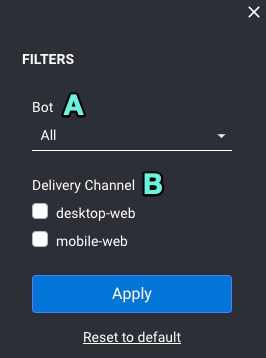
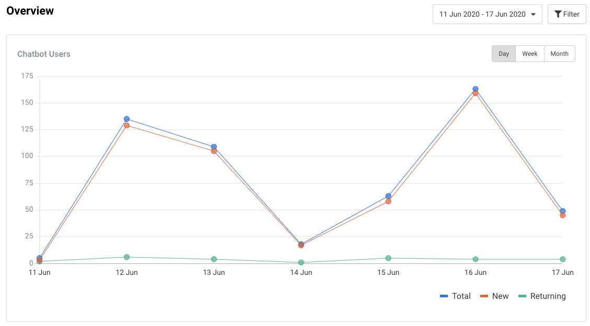
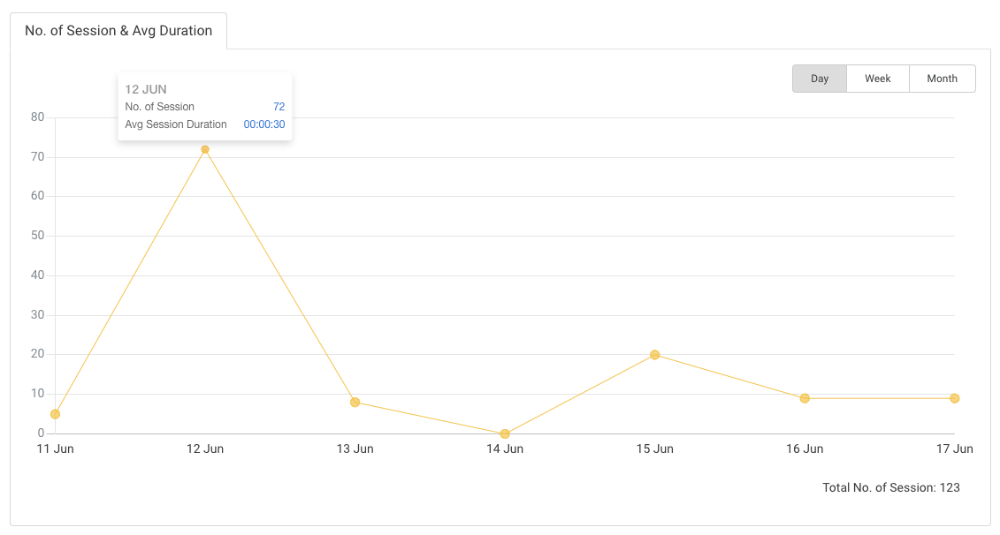
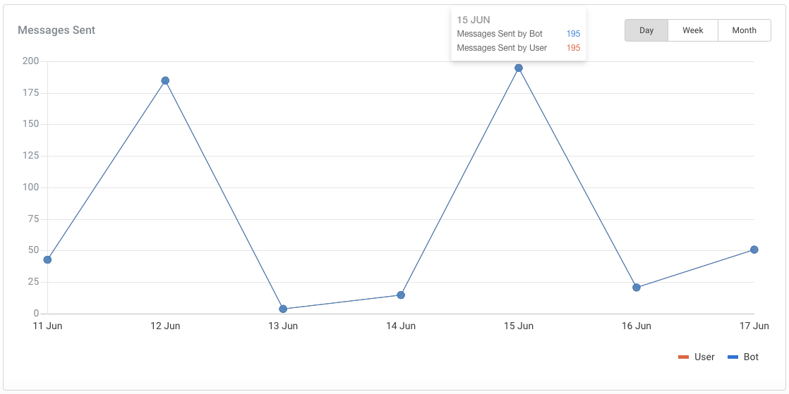
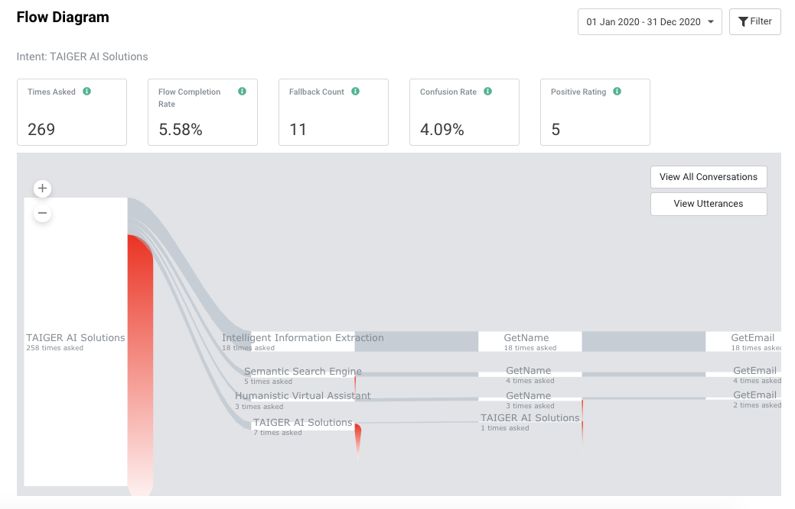

# Chat Analytics

The Analytics component of Converse provides information about the system usage. It allows you to view data concerning metrics revolving around engagement, user performance, user satisfaction & user statistics. These data can be filtered by several parameters, such as the time period, bot, or delivery channel.

## Overview

The overview page shows the chatbot active users trend and chatbot performance. To navigate the Analytics page, select the  button on the navigation bar.

## Filter Panel

The analytics page shows data for ALL bots by default. To access the filter, select the  button on the top right hand corner of the page. The filter panel will slide in from the right.

**Filter by Bot:** To filter the analytics data by bots, select the particular bot by expanding the dropdown panel. The dropdown panel will display all the bots you have permission for.

**Filter by Delivery Channel**: Filter the analytics data by Delivery Channel by selecting the relevant checkboxes.

## Chatbot Usage Trend

This graph shows the data trend lines for:

* New Users \(Red Trend Line\) - Unique first time users of the chatbot.
* Returning Users \(Blue Trend Line\) - A returning user.
* Total Users \(Green Trend Line\) - Total number of new users and returning users.

You can specify the date range to filter the data and the frequency for day, week, or month. You can also filter the bot and delivery channel used.

## Chatbot Performance

The Chatbot Performance displays an overview of the top-level metrics that indicate the performance of the bot over the specified period in the Date Range Filter.

Changes in metrics are expressed in either percentages or the absolute value, with the change being obtained by comparing this period vs the last period. For example:

* If the Date Range filter is set from 7 to 7 May \(1 day\), the period to compare with is 6 - 6 May \(1 day\)
* If the Date Range filter is set from 8 to 14 May \(7 days\), the period to compare with is 1 - 7 May \(7 days\).
* If the Date Range filter is set from 1 to 31 May \(31 days\), the period to compare with is 31 March - 30 April \(31 days\).

The following metrics are covered and shown as “cards” on the chatbot performance page:

#### 

<table>
  <thead>
    <tr>
      <th style="text-align:left"><b>Name</b>
      </th>
      <th style="text-align:left"><b>Interpretation</b>
      </th>
      <th style="text-align:left"><b>Description</b>
      </th>
    </tr>
  </thead>
  <tbody>
    <tr>
      <td style="text-align:left">Total Users</td>
      <td style="text-align:left">Higher is better</td>
      <td style="text-align:left">The quantity of users who talked with the chatbot (does not need to be
        unique users)</td>
    </tr>
    <tr>
      <td style="text-align:left">Chatbot Rating</td>
      <td style="text-align:left">Higher is better</td>
      <td style="text-align:left">The average chatbot rating received</td>
    </tr>
    <tr>
      <td style="text-align:left">Deflection Rate</td>
      <td style="text-align:left">Lower is better</td>
      <td style="text-align:left">
        
The percentage of conversations where the user:

        <ul>
          <li>obtained a useful answer or;</li>
          <li>had significant activity,</li>
        </ul>
        
AND

        <ul>
          <li>the Escalate intent was not triggered</li>
        </ul>
      </td>
    </tr>
    <tr>
      <td style="text-align:left">Chatbot Rating</td>
      <td style="text-align:left">Higher is better</td>
      <td style="text-align:left">The average chatbot rating received</td>
    </tr>
    <tr>
      <td style="text-align:left">Total Fallback Count</td>
      <td style="text-align:left">Lower is better</td>
      <td style="text-align:left">The total number of instances where the system was not able to understand
        the user</td>
    </tr>
    <tr>
      <td style="text-align:left">Avg Session Duration</td>
      <td style="text-align:left">Higher is better</td>
      <td style="text-align:left">The average duration from Session Start to Session End</td>
    </tr>
    <tr>
      <td style="text-align:left">Overall Confusion</td>
      <td style="text-align:left">Lower is better</td>
      <td style="text-align:left">The percentage of interactions where the system was not able to understand
        the user</td>
    </tr>
  </tbody>
</table>

## Engagement

The engagement component of analytics consists of data regarding how the user interacted with the bot. To access this page, select the  tab on the left hand panel of the analytics page.

### User Activities

This metric shows the overall usage in terms of total number of sessions \(conversations\) and messages sent by the user.

### **No of Sessions**

The total number of sessions occurs in a given day. It is the sum of all conversations that was conducted between 0000hrs and 2359hrs for a given day.

### **Average Duration**

The average duration is calculated as the Total Session Duration / No. of Sessions

### **Messages Sent**

The total number of messages sent by users and the bot.

## Deflection Rate

The deflection rate represents the percentage of conversations where the user obtained a useful answer or had significant activity, and the Escalate intent was not triggered. In essence, it signifies the rate at which a user question / query was fulfilled without needing the help of a live agent.

The deflection rate is calculated by comparing the conversations that had occurred in the current period against the conversations from the previous period. Hence, the deflection rate is dependent on the date range selected.

<table>
  <thead>
    <tr>
      <th style="text-align:left">Metric</th>
      <th style="text-align:left">Description</th>
    </tr>
  </thead>
  <tbody>
    <tr>
      <td style="text-align:left"><b>Deflection Rate</b>
      </td>
      <td style="text-align:left">
        
Deflection describes the scenario where the user was able obtain to useful
          answer(s) from the chatbot, which may have resulted in him/her not asking
          the physical customer support helpdesk for help (Escalate was reached)

        
Deflection Rate % = ( No. of Helpful Conversations + No. of Conversations
          with significant activity ) / Total Conversations

      </td>
    </tr>
    <tr>
      <td style="text-align:left"><b>No Activity</b>
      </td>
      <td style="text-align:left">
        
No. of Conversations with No Activity is the Total Conversations:

        <ul>
          <li>WITHOUT No. of Conversations that Escalated</li>
          <li>WITHOUT No. of Helpful Conversations</li>
          <li>WITHOUT No. of Conversations with significant activity</li>
        </ul>
      </td>
    </tr>
    <tr>
      <td style="text-align:left"><b>Escalation Enquiries Reached</b>
      </td>
      <td style="text-align:left">Sum of total conversations in which there was at least 1 message that
        was escalated</td>
    </tr>
    <tr>
      <td style="text-align:left"><b>Marked an Answer as helpful</b>
      </td>
      <td style="text-align:left">
        
No. of Helpful Conversations within a period is:

        
Sum of conversations in which there was at least 1 system message rated
          to be useful by users

      </td>
    </tr>
  </tbody>
</table>

#### 

#### 

#### 

#### 

#### 

## Conversations

This component captures the conversation with users, alongside with metadata such as conversation ID, start, end, duration of conversation. Conversations can be filtered by clicking on the  button. You can also mass export all conversation data as an excel spreadsheet by clicking on the button.

#### **Viewing Individual Conversations**

You can view the individual conversation history by clicking on the  button under the action column for each conversation. A conversation history pop up will then appear, alongside its relevant metadata and export functionality.

## Content Performance

The following metric cards are shown in the content performance page:

| **Name** | **Interpretation** | **Description** |
| :--- | :--- | :--- |
| Total Fallback Count | Lower is better | The total number of instances where the system was not able to understand the user |
| Overall Confusion | Lower is better | The percentage of interactions where the system was not able to understand the user |
| No. of Message Sent by User | Higher is better | No. of Message Sent by User |
| Total No. of Answer Rated Helpful | Higher is better | Total No. of Answer Rated Helpful |

#### 

### Flow Diagram

This page shows the detailed content performance for a specific Intent in the form of a flow diagram. To access the flow diagram, click on the “View Flow Diagram” option.

The following metric cards are shown in the each individual flow diagram page:

| **Name** | **Interpretation** | **Description** |
| :--- | :--- | :--- |
| Times Asked | Higher is better | The number of times this Intent was triggered |
| Fall Completion Rate | Higher is better | The percentage of instances where the user reached the final state of the Intent's dialog flow |
| Fallback Count | Lower is better | The number of occurrences where the user said something unexpected while progressing within this Intent's dialog flow |
| Confusion Rate | Lower is better | The percentage of interactions where the system was not able to understand the user, while handling this Intent |
| Positive Rating | Higher is better | The number of instances where a user marked an answer within this flow as correct by clicking on the "tick" icon |

**Interpreting the Flow Diagram:**

<table>
  <thead>
    <tr>
      <th style="text-align:left">Name</th>
      <th style="text-align:left">Image</th>
      <th style="text-align:left">Description</th>
    </tr>
  </thead>
  <tbody>
    <tr>
      <td style="text-align:left">State Cards</td>
      <td style="text-align:left">
        
      </td>
      <td style="text-align:left">Shows the number of times a particular subsequent state was triggered.</td>
    </tr>
    <tr>
      <td style="text-align:left">Exit Reason Popover</td>
      <td style="text-align:left">
        
      </td>
      <td style="text-align:left">Shows the number of drop offs. Drop Offs are instances where the user
        did not continue using the chatbot (and allowed the session to expire)
        immediately after this State.</td>
    </tr>
    <tr>
      <td style="text-align:left">State Card Popover</td>
      <td style="text-align:left">
        
      </td>
      <td style="text-align:left">
        <ul>
          <li><b>Income</b>: The number of users who reached the state.</li>
          <li><b>Outcome</b>: The number of users who completed the state.</li>
          <li><b>Drop offs</b>: The number of users who dropped off from the state.</li>
        </ul>
      </td>
    </tr>
    <tr>
      <td style="text-align:left">Flow Lines</td>
      <td style="text-align:left">
        
      </td>
      <td style="text-align:left">Shows the number and percentage of users moving from one state to the
        others.</td>
    </tr>
  </tbody>
</table>

## User Satisfaction

| **Name** | **Interpretation** | **Description** |
| :--- | :--- | :--- |
| Average Rating | Higher is better | The average rating score based on the feedback given via the Feedback “stars” rating \(1-6\) |

