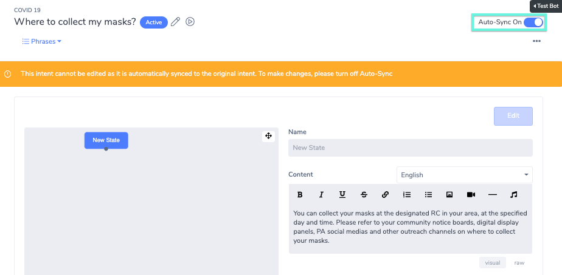

# Common Space

## Overview and Configuration

### What is Common Space

The Common Space allows Organizations to share Intents with other Organizations on the same Converse installation. The business objectives here are:

* Encourage Knowledge Reuse within the organization
* Create a single-source-of-truth for better knowledge management

### Common Library Types

There are two Common Library Types

* "Restricted" Type - Only specified Contributors can share to these Libraries
* "Open" Type - Any Bot Admin can share Intents to these Libraries

Each Library Type can also be given a custom name, e.g. "Policy" Library or "Community" Library.

Converse supports creating any number of Restricted and Open Library types. This needs to be set up at deployment time. Please contact a TAIGER or TAIGER Technical Partner representative for more information.

## Common Space Administration

### Creating Common Libraries

1. Navigate to the  tab of the navigation bar.
2. Select the on the library side panel. The following Popup will appear:
3. Fill in the library name and assign the intended library type. The library type shown depends on what was configured beforehand \(see [Common Library Types](common-space.md#common-library-types)\)
4. Click 

### Managing Contributor Access for Restricted Libraries

Note: You need to have Super Admin access to use this feature.

From the Common Space page, click on the '...' icon on the top-right corner of the screen

In the popup that appears, you will be able to add/remove Bot Admins from your own Organization as Contributors to the Restricted Library. Only Contributors are allowed to share Intents to Restricted Libraries.

### Sharing Intents to Common Libraries

You can choose to share intents from your library to common libraries. To do so, you will first need to navigate to the library of intents you want to share.

1. Select the intents you want to share by checking their individual checkboxes.
2. Click on the  button to initiate the sharing process. The following pop-up window will appear:

1. Select the library in the common space that you would like to share the selected intents to and click  to confirm.

### Importing Common Intents

You can also import common intents from community libraries into your libraries.

1. Navigate to the  tab of the navigation bar.
2. Select the community library from the Libraries Side Panel that contains the common intents you would like to import.
3. Select the intents you want to import by checking their individual checkboxes.
4. Click on the  button to initiate the importing process.

Select Bot & Library

1. Select the bot and library you would like to export the selected intents to
2. Configure the settings for the import
3. Auto-Sync - Turn on if you want the exported intent to be automatically updated if the original intents are updated.
4. Follow Intents - Turn on to receive notifications should there be any changes made to the original intents.
5. Publish Immediately - Turn on to activate intents immediately after they have been added to your bot.

### Resolving Conflicting Intents

In the event that similar intents and phrases already exist in the library, you will need to resolve the conflicts to continue with the import. Deconflicting will be done on the conflict resolution wizard. The wizard will show the following information:

1. List of the conflicting intents to be resolved
2. Intent from the common space
3. Existing intent from the library

Phrases / Intents that are in direct conflict will be lighted in red.

### Resolving Conflicts

Conflict Scenarios

There are three possible conflict types occurring when importing intents.

1. Intent Name conflict
2. Phrase conflict
3. Intent Name and Phrases conflict

For each of these scenarios there are a few ways to resolve:

### **Change the Intent Name**

* Navigate to the existing intent in the library.
* Click on the  icon. The intent name will now become an editable field.
* Edit the intent name and press the “enter” key to save changes.
* After the intent names have been deconflicted, they will no longer be in red font. The alert bar on top will turn green and show the following:

### **Deconflict the Phrases**

* The system is flagging the Phrases that are found in both Intents in red font.
* To resolve this, Exclude or Delete the conflicting Phrase\(s\) from either the Intent From Common Space OR the Existing Intent, respectively. You can do so by clicking on the icon on the right-side of each Phrase
* After the Phrases have been deconflicted, the alert bar on top will turn green.

#### **Option 1: Replace the Existing Intent**

#### **Option 2: Remove the Intent from being imported**

To remove the intent, click on the  icon for the intent being imported.

Once all conflicts are resolved, click on the button to continue. A summary page of the changes being made will be displayed.

Click on the  to confirm import.

## Managing Imported Intents

Once intents from the common space are imported, you will be able to view them in their parent libraries. Imported intents will be earmarked with the name of the community library that it was imported from. Click on the imported intent to manage it.

#### 

#### 8.5.1 Switch Auto-Sync Setting

Use the  switch to manage the Auto-Sync setting.

#### 8.5.2 Editing Imported Intents

To edit Imported intents, you will need to turn off auto-sync. Once auto-sync is turned off, the input fields for the State Configuration Panel will be activated.

