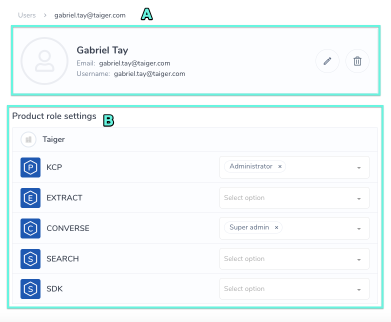
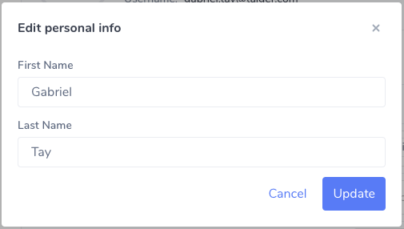
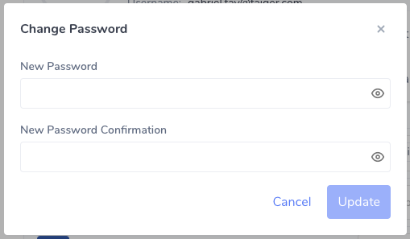

# User & Roles Management

User and Role management are done on the KPO Platform, which Converse sits on.


Note: You need to have the Super Admin role to access the functionalities in this section.


To access the settings for User & Roles Management:

1. Log in onto the KPO platform.
2. Click on the  icon on the navigation bar. You will be directed to the Organisation Management page for your organisation.

## Creating a new User

1. Click on the button. A pop-up window will be displayed asking for the new user’s details such as Name, Username, Email, Password & Organisation.

1. Complete the form and click on  to create the new user.

## View User

On the organisation management page, click on the user you want to view. The information of the user profile will be displayed in 2 panels:

1. User Information Panel - For editing user information and/ro deleting user
2. Product Role Settings - For assigning products / setting roles for users

## **Edit User**

Click on the  button to edit. A panel will be displayed with two options:

1. Edit Personal Info. Select this option to edit the first and last name. A pop-up will appear with the user’s existing first and last name as editable input fields.

1. Change Password. Select this option to edit the password. A pop-up will appear prompting for the new password and new password confirmation.

## **Delete User**

1. Click on the button to delete the user.
2. A pop-up will appear prompting for confirmation. Click to delete the user.

## Assigning Converse & Setting Roles to a User

To assign Converse to a user, you will first need to set the user a role. 3 possible roles can be assigned to users:

* Super Admin
* Admin
* User

The breakdown of the roles and access rights will be covered in more detail in the next section.

1. For the selected user, navigate to the product role settings panel and search for CONVERSE.
2. Expand the dropdown for the CONVERSE product. All the 3 possible roles will appear as options.
3. Select the desired role to be assigned for the selected user. Once the assignment is successful, the following notification will be displayed.

## Roles and Access Rights

<table>
  <thead>
    <tr>
      <th style="text-align:left">Access Rights</th>
      <th style="text-align:left"><b>Super Admin</b>
      </th>
      <th style="text-align:left"><b>Admin</b>
      </th>
      <th style="text-align:left"><b>User</b>
      </th>
    </tr>
  </thead>
  <tbody>
    <tr>
      <td style="text-align:left">
        
User Management

        <ul>
          <li>Create User</li>
          <li>Edit User</li>
          <li>Delete User</li>
        </ul>
      </td>
      <td style="text-align:left">Full Access</td>
      <td style="text-align:left">No Access</td>
      <td style="text-align:left">No Access</td>
    </tr>
    <tr>
      <td style="text-align:left">
        
Account Settings

        <ul>
          <li>Set Username</li>
          <li>Set Password</li>
        </ul>
      </td>
      <td style="text-align:left">Full Access</td>
      <td style="text-align:left">Full Access</td>
      <td style="text-align:left">Full Access</td>
    </tr>
    <tr>
      <td style="text-align:left">Analytics (all functionality included)</td>
      <td style="text-align:left">Full Access for All Bots</td>
      <td style="text-align:left">Yes, if have View Permission on Bot</td>
      <td style="text-align:left">Yes, if have View Permission on Bot</td>
    </tr>
    <tr>
      <td style="text-align:left"><b>Manage Bot Content </b>
      </td>
      <td style="text-align:left"></td>
      <td style="text-align:left"></td>
      <td style="text-align:left"></td>
    </tr>
    <tr>
      <td style="text-align:left">View Intents, Phrases, Libraries</td>
      <td style="text-align:left">Full Access for All Bots</td>
      <td style="text-align:left">Yes, if have View Permission on Bot</td>
      <td style="text-align:left">Yes, if have View Permission on Bot</td>
    </tr>
    <tr>
      <td style="text-align:left">Create/Edit/Delete Intents, Phrases, Libraries for a Bot</td>
      <td style="text-align:left">Full Access for All Bots</td>
      <td style="text-align:left">Yes, if have Edit Permission on Bot</td>
      <td style="text-align:left">Yes, if have Edit Permission on Bot</td>
    </tr>
    <tr>
      <td style="text-align:left">Train NLU</td>
      <td style="text-align:left">Full Access for All Bots</td>
      <td style="text-align:left">Full Access</td>
      <td style="text-align:left">No Access</td>
    </tr>
    <tr>
      <td style="text-align:left">Test All / Test Phrases</td>
      <td style="text-align:left">Full Access for All Bots</td>
      <td style="text-align:left">Full Access</td>
      <td style="text-align:left">Full Access</td>
    </tr>
    <tr>
      <td style="text-align:left"><b>Bot Configuration</b>
      </td>
      <td style="text-align:left"></td>
      <td style="text-align:left"></td>
      <td style="text-align:left"></td>
    </tr>
    <tr>
      <td style="text-align:left">Edit Bot Name</td>
      <td style="text-align:left">Full Access for All Bots</td>
      <td style="text-align:left">Yes, if have Edit Permission on Bot</td>
      <td style="text-align:left">Yes, if have Edit Permission on Bot</td>
    </tr>
    <tr>
      <td style="text-align:left">Manage Bot Libraries</td>
      <td style="text-align:left">Full Access for All Bots</td>
      <td style="text-align:left">Yes if have Edit permissions on Bot</td>
      <td style="text-align:left">Yes, if have Edit Permission on Bot</td>
    </tr>
    <tr>
      <td style="text-align:left">Manage Bot Administrators and Permissions</td>
      <td style="text-align:left">Full Access for All Bots</td>
      <td style="text-align:left">Yes if have Owner permissions on Bot</td>
      <td style="text-align:left">Yes if have Owner permissions on Bot</td>
    </tr>
    <tr>
      <td style="text-align:left">
        
Advanced Bot Configurations

        <ul>
          <li>Set Default Bot Config</li>
          <li>Default CSS</li>
          <li>Default Widget CSS</li>
          <li>Avatar</li>
          <li>Landing Page</li>
          <li>Asset Library</li>
        </ul>
      </td>
      <td style="text-align:left">Full Access for All Bots</td>
      <td style="text-align:left">Yes, if have Edit Permission on Bot</td>
      <td style="text-align:left">Yes, if have Edit Permission on Bot</td>
    </tr>
    <tr>
      <td style="text-align:left"><b>Manage Unhandled Phrase for a Bot</b>
      </td>
      <td style="text-align:left"></td>
      <td style="text-align:left"></td>
      <td style="text-align:left"></td>
    </tr>
    <tr>
      <td style="text-align:left">View Unhandled Phrases</td>
      <td style="text-align:left">Full Access for All Bots</td>
      <td style="text-align:left">Yes, if have View Permission on Bot</td>
      <td style="text-align:left">Yes, if have View Permission on Bot</td>
    </tr>
    <tr>
      <td style="text-align:left">Resolve / Mark Invalid / Revert</td>
      <td style="text-align:left">Full Access for All Bots</td>
      <td style="text-align:left">Yes, if have Edit Permission on Bot</td>
      <td style="text-align:left">Yes, if have Edit Permission on Bot</td>
    </tr>
    <tr>
      <td style="text-align:left">Group Similar Phrases</td>
      <td style="text-align:left">Full Access for All Bots</td>
      <td style="text-align:left">
        
Full Access

        
Must have at least View permission for the Bot

      </td>
      <td style="text-align:left">No Access</td>
    </tr>
    <tr>
      <td style="text-align:left"><b>Ontology Management</b>
      </td>
      <td style="text-align:left"></td>
      <td style="text-align:left"></td>
      <td style="text-align:left"></td>
    </tr>
    <tr>
      <td style="text-align:left">View Ontology</td>
      <td style="text-align:left">Full Access for All Bots</td>
      <td style="text-align:left">Yes, if have View Permission on Bot</td>
      <td style="text-align:left">Yes, if have View Permission on Bot</td>
    </tr>
    <tr>
      <td style="text-align:left">
        
Manage Ontology Data

        <ul>
          <li>Clear Ontology</li>
          <li>Load Ontology</li>
          <li>Clear Ontology Index</li>
          <li>Build Ontology Index</li>
          <li>Export Ontology</li>
          <li>Import Ontology</li>
        </ul>
      </td>
      <td style="text-align:left">Full Access for All Bots</td>
      <td style="text-align:left">
        
Partial Access

        
&quot;Clear Ontology&quot; is not available.

      </td>
      <td style="text-align:left">No Access</td>
    </tr>
    <tr>
      <td style="text-align:left">Train Ontology</td>
      <td style="text-align:left">Full Access for All Bots</td>
      <td style="text-align:left">Yes, if have View Permission on Bot</td>
      <td style="text-align:left">No Access</td>
    </tr>
  </tbody>
</table>

